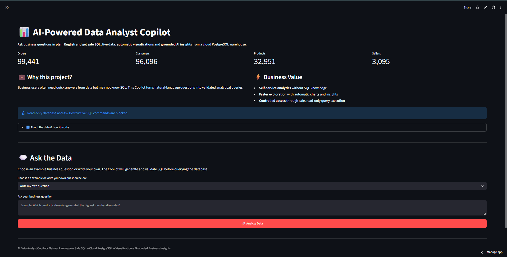
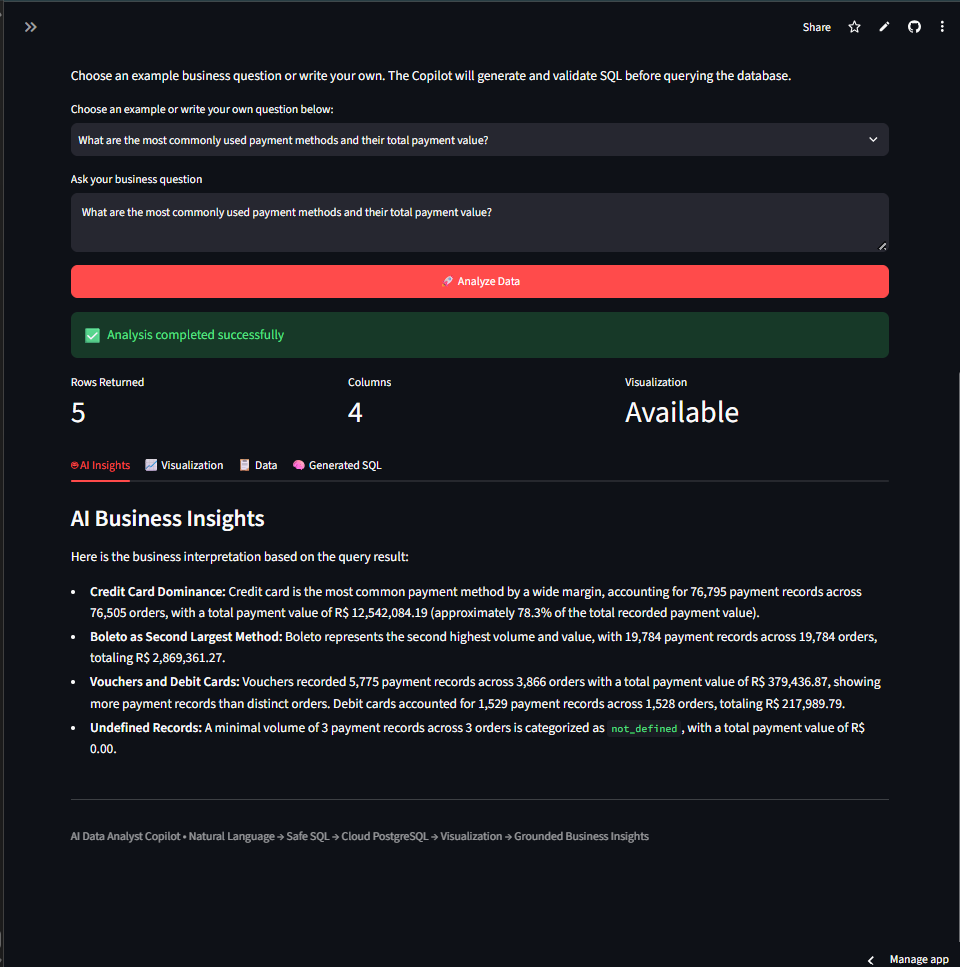
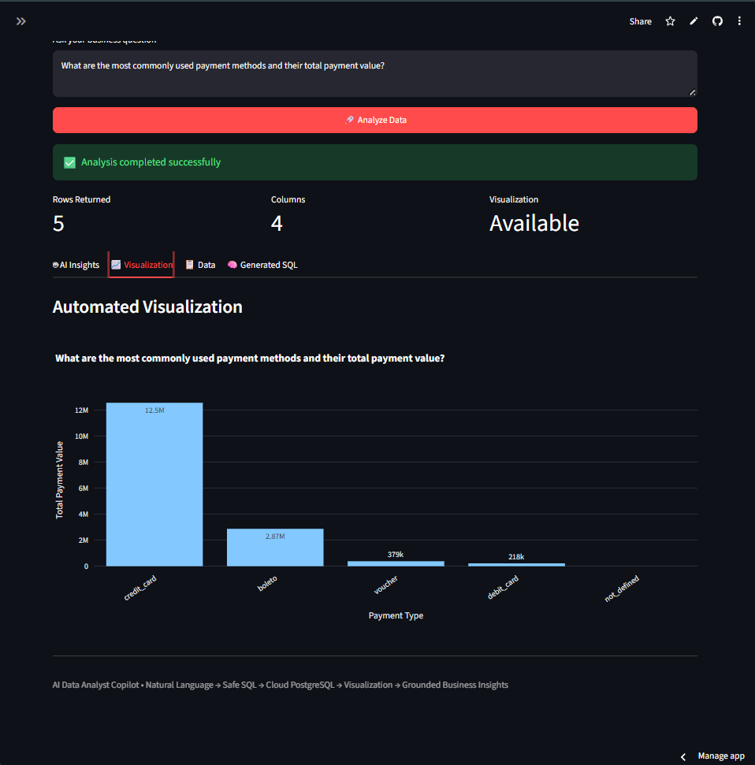
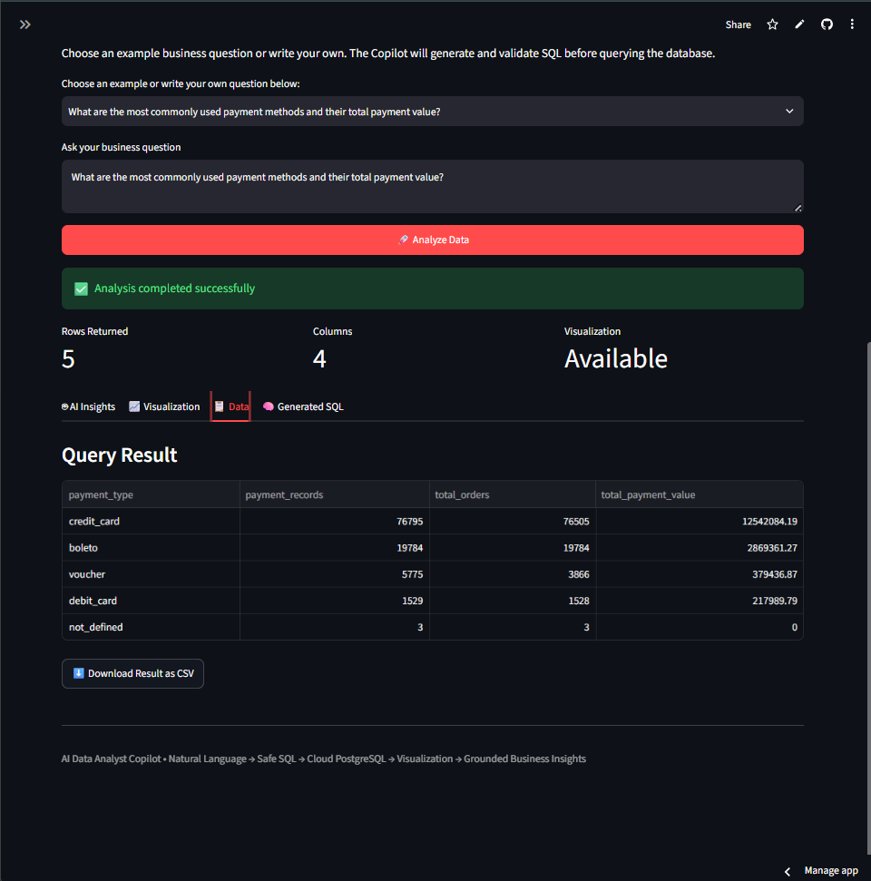
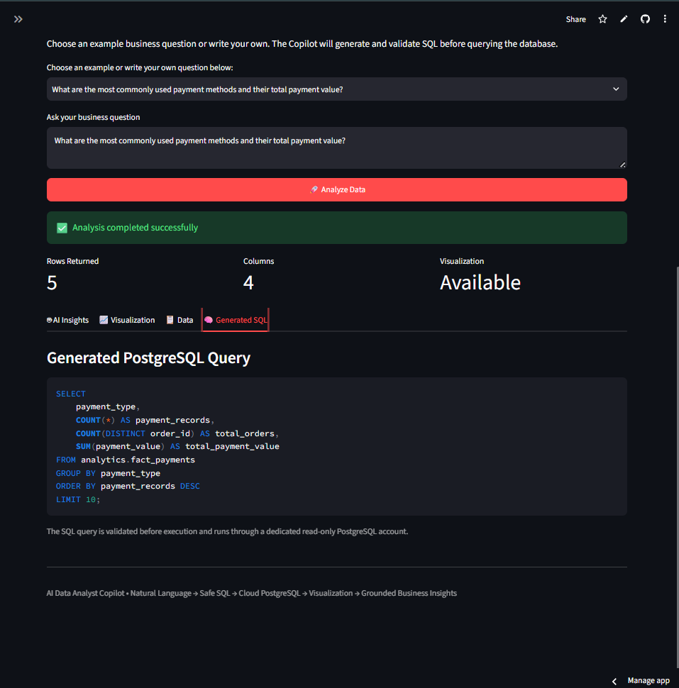

# 📊 AI-Powered Data Analyst Copilot

An end-to-end AI analytics portfolio project that converts **plain-English business questions into safe PostgreSQL queries, live data results, automated visualizations, and grounded business insights**.

> **Live Demo:** https://ai-data-analyst-copilot-9dmnh4izbccbpgpuyur8e2.streamlit.app  
> **Repository:** https://github.com/Rishabh11122001/ai-data-analyst-copilot

---

## 📌 Table of Contents

- [Project Overview](#-project-overview)
- [Business Problem](#-business-problem)
- [Project Summary](#-project-summary)
- [Dataset](#-dataset)
- [Tools & Technologies](#-tools--technologies)
- [Project Workflow](#-project-workflow)
- [Application Screenshots](#-application-screenshots)
- [Core Features](#-core-features)
- [SQL Safety & Database Security](#-sql-safety--database-security)
- [Automated Testing](#-automated-testing)
- [Deployment & Monitoring](#-deployment--monitoring)
- [Project Structure](#-project-structure)
- [How to Run](#-how-to-run)
- [Limitations](#-limitations)
- [Author](#-author)

---

## 🎯 Project Overview

The goal of this project is to demonstrate how generative AI can be integrated into a real analytics workflow rather than used only as a chatbot.

A user can ask a question such as:

> **What are the top 5 product categories by merchandise sales?**

The application then understands the schema and business definitions, generates PostgreSQL, validates the SQL, queries a read-only cloud database, returns structured data, creates a visualization, and generates business insights grounded in the result.

---

## 💼 Business Problem

Business teams often need quick answers from operational data, but an ad-hoc question can require an analyst to understand the database, write SQL, validate the query, retrieve data, build a chart, and interpret the result.

This project demonstrates a controlled AI-assisted workflow that reduces repetitive exploratory work while keeping the database protected.

### Business Value

- **Self-Service Analytics** — ask business questions in natural language.
- **Faster Exploration** — SQL, data retrieval, visualization, and first-level interpretation happen in one workflow.
- **Consistent Metrics** — a semantic layer defines important analytical concepts.
- **Grounded Insights** — explanations use the actual query result.
- **Controlled Access** — the application uses a dedicated read-only PostgreSQL role.

---

## 📋 Project Summary

| Area | Details |
|---|---|
| Project Type | AI-Powered Data Analytics Application |
| Data Source | Brazilian Olist E-Commerce Dataset |
| Orders | 99,441 |
| Unique Customers | 96,096 |
| Products | 32,951 |
| Sellers | 3,095 |
| Database | PostgreSQL |
| Cloud Database | Supabase |
| Frontend | Streamlit |
| AI Providers | Google Gemini + Groq fallback |
| Visualization | Plotly |
| SQL Validation | Custom validator + `sqlparse` |
| Database Access | Dedicated read-only PostgreSQL role |
| Query Timeout | 10 seconds |
| Maximum Result Rows | 500 |
| Automated Tests | 24 passed |
| Deployment | Streamlit Community Cloud |
| Monitoring | UptimeRobot |

---

## 🗂️ Dataset

The application uses the **Brazilian Olist E-Commerce dataset**, transformed into an analytical PostgreSQL model.

### Dimensions
- `analytics.dim_customer`
- `analytics.dim_product`
- `analytics.dim_seller`
- `analytics.dim_date`

### Fact Tables
- `analytics.fact_orders`
- `analytics.fact_order_items`
- `analytics.fact_payments`
- `analytics.fact_reviews`

The model supports analysis of sales, products, sellers, customers, repeat purchasing, payments, delivery performance, and reviews.

---

## 🛠️ Tools & Technologies

| Tool / Technology | Use |
|---|---|
| Python | Application logic and analytics workflow |
| PostgreSQL | Analytical database |
| Supabase | Cloud PostgreSQL hosting |
| SQLAlchemy | Database connection and query execution |
| Pandas | Query-result processing |
| Streamlit | Interactive web application |
| Plotly | Automated visualizations |
| Gemini | Primary LLM provider |
| Groq | LLM fallback provider |
| `sqlparse` | SQL parsing and validation support |
| Pytest | Automated testing |
| Git / GitHub | Version control and publishing |
| UptimeRobot | Availability monitoring |

---

## 🔄 Project Workflow

| Stage | What Happens |
|---|---|
| 1. User Question | User asks a business question in plain English |
| 2. Schema Context | Application supplies database schema and relationships |
| 3. Semantic Context | Business metric definitions and guardrails are supplied |
| 4. LLM Generation | Gemini or Groq generates PostgreSQL |
| 5. SQL Validation | Unsafe or destructive SQL is blocked |
| 6. Query Execution | Safe SQL runs against read-only Supabase PostgreSQL |
| 7. Result Processing | Query output is loaded into a Pandas DataFrame |
| 8. Visualization | Plotly chart is selected automatically |
| 9. AI Insight | LLM explains the result without unsupported claims |

```text
Business Question
       │
       ▼
Schema Context + Semantic Layer
       │
       ▼
Gemini / Groq
       │
       ▼
Generated PostgreSQL
       │
       ▼
SQL Safety Validator
       │
       ▼
Read-Only Supabase PostgreSQL
       │
       ▼
Pandas DataFrame
       │
       ├──────────────► Automated Visualization
       │
       └──────────────► Grounded Business Insights
```

---

## 📸 Application Screenshots

### 1. Application Overview



### 2. AI Business Insights



### 3. Automated Visualization



### 4. Query Result Data



### 5. Generated SQL Query



---

## ⚙️ Core Features

### Natural Language to SQL
Business questions are converted into PostgreSQL automatically.

### Schema-Aware Query Generation
The LLM receives tables, columns, relationships, grain, business definitions, and analytical guardrails.

### Business Semantic Layer
Important metrics are explicitly defined.

**Order-level merchandise sales**
```sql
SUM(fact_orders.merchandise_value)
```

**Product/category/seller merchandise sales**
```sql
SUM(fact_order_items.price)
```

**True customer identity**
```text
customer_unique_id
```

**Order counts from payment-grain data**
```sql
COUNT(DISTINCT order_id)
```

### Multi-Provider LLM Fallback
- **Primary:** Google Gemini
- **Fallback:** Groq

### Automated Visualization
The visualizer supports bar charts, time-series line charts, scatter plots, and no-chart cases where visualization adds little value.

### Grounded Business Insights
The insight layer uses the returned query result and avoids unsupported claims about causality, campaigns, pricing strategy, seasonality, external events, or seller business models.

---

## 🔒 SQL Safety & Database Security

### Application-Level Validation

Allowed analytical query forms:

```text
SELECT
WITH
```

Blocked operations include:

```text
INSERT
UPDATE
DELETE
DROP
ALTER
TRUNCATE
CREATE
GRANT
REVOKE
COPY
CALL
EXECUTE
MERGE
VACUUM
```

The validator also blocks multiple SQL statements.

### Database-Level Protection

The deployed application connects through:

```text
ai_analyst_ro
```

| Permission | Status |
|---|---|
| SELECT | ✅ Allowed |
| INSERT | ❌ Blocked |
| UPDATE | ❌ Blocked |
| DELETE | ❌ Blocked |

The role also uses:

```text
default_transaction_read_only = ON
```

### Query Guardrails

- Statement timeout: **10 seconds**
- Maximum returned rows: **500**

---

## 🧪 Automated Testing

Run:

```bash
pytest tests -v
```

| Component | Tests |
|---|---:|
| SQL Validator | 11 |
| Query Executor | 6 |
| Visualizer | 7 |
| **Total** | **24** |

Current result:

```text
24 passed
```

---

## ☁️ Deployment & Monitoring

### Production Architecture

```text
User / Recruiter
       │
       ▼
Streamlit Community Cloud
       │
       ▼
Gemini / Groq
       │
       ▼
SQL Safety Layer
       │
       ▼
Read-Only Database Role
       │
       ▼
Supabase PostgreSQL
```

### Secrets Management

- Local development: `.env`
- Production: Streamlit Secrets
- GitHub repository: placeholder values only in `.env.example`

### Monitoring

Two UptimeRobot monitors are configured:

1. Streamlit application monitor
2. Supabase keepalive / health monitor

The health endpoint exposes no analytical business data.

---

## 📁 Project Structure

```text
ai-data-analyst-copilot/
│
├── app/
│   ├── app.py
│   ├── analyzer.py
│   ├── database.py
│   ├── insight_generator.py
│   ├── llm.py
│   ├── query_executor.py
│   ├── schema.py
│   ├── semantic_layer.py
│   ├── sql_generator.py
│   ├── sql_validator.py
│   └── visualizer.py
│
├── tests/
│   ├── test_query_executor.py
│   ├── test_sql_validator.py
│   └── test_visualizer.py
│
├── images/
│   ├── app_overview.png
│   ├── ai_insights.png
│   ├── automated_visualization.png
│   ├── query_result_data.png
│   └── generated_sql_query.png
│
├── .env.example
├── .gitignore
├── requirements.txt
└── README.md
```

---

## 🚀 How to Run

```bash
git clone https://github.com/Rishabh11122001/ai-data-analyst-copilot.git
cd ai-data-analyst-copilot
python -m venv .venv
.venv\Scripts\activate
pip install -r requirements.txt
streamlit run app/app.py
```

Before running, create a `.env` using `.env.example` and configure your LLM and PostgreSQL credentials.

---

## ⚠️ Limitations

- Natural-language-to-SQL systems can still generate analytically imperfect queries for ambiguous questions.
- The semantic layer covers the main business concepts in this dataset, not every possible business definition.
- AI-generated insights are descriptive and should not be treated as causal evidence.
- The demo uses free-tier cloud infrastructure.
- The Olist dataset covers 2016–2018 and is used for portfolio demonstration rather than current market analysis.

---

## 🔗 Project Links

**Live Application:**  
https://ai-data-analyst-copilot-9dmnh4izbccbpgpuyur8e2.streamlit.app

**GitHub Repository:**  
https://github.com/Rishabh11122001/ai-data-analyst-copilot

---

## 👤 Author

**Rishabh**

Data Analytics | SQL | Python | Power BI | AI-Assisted Analytics
